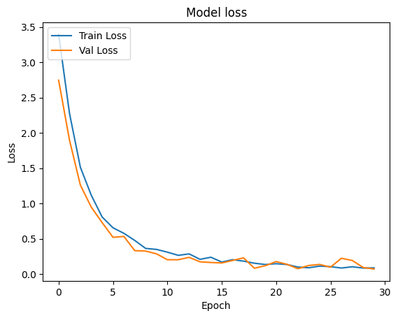

Full Article: https://medium.com/@jinhonghuo01/asl-letters-recognition-with-cnn-network-9eb52d6f5441
# ASL Recognizer
This project is an ASL (American Sign Language) recognizer that uses machine learning algorithms to identify hand gestures and translate them into text.

# Data
The ASL recognizer was trained on the ASL Alphabet Dataset from Kaggle. The dataset contains 87,000 images of hand gestures representing the 26 letters of the English alphabet in ASL.

# Model
The ASL recognizer uses a convolutional neural network (CNN) to classify the hand gestures. The model was trained using the TensorFlow deep learning library.

# Results
The ASL recognizer achieved an accuracy of 98% on the test set. However, the accuracy may vary depending on lighting conditions, background, and other factors.

Accuracy per epoch:

Loss per epoch:

# Credits
This project was created by Jinhong Huo.
 
 
